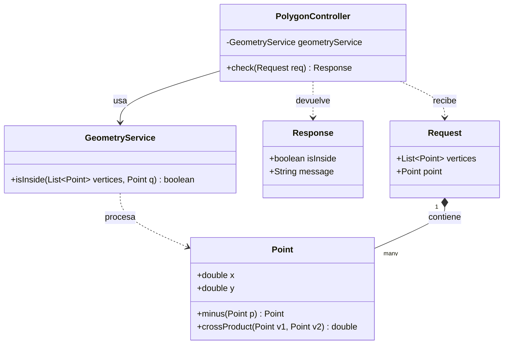
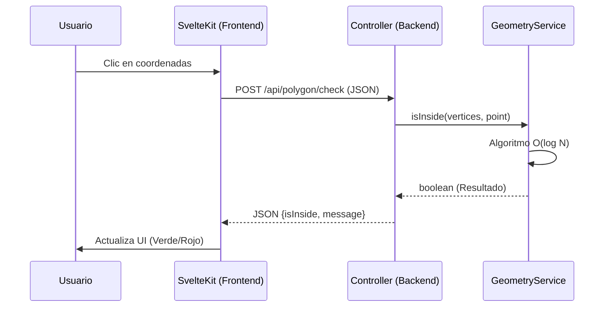

# Reporte de Proyecto: Análisis Geométrico en $O(\log N)$
**Metodología:** Cascada (Waterfall)

---

## Fase 1: Requerimientos
El objetivo del sistema es determinar de manera eficiente si un punto arbitrario se encuentra dentro, fuera o en la frontera de un polígono convexo. 

### Requerimientos Funcionales:
* El sistema debe recibir un conjunto de vértices que formen un polígono convexo, ingresados estrictamente en orden antihorario (CCW).
* El sistema debe recibir las coordenadas de un punto de prueba.
* El núcleo matemático debe calcular la pertenencia del punto utilizando un algoritmo de búsqueda binaria sectorial para garantizar una complejidad de tiempo de $O(\log N)$.
* El sistema debe retornar el resultado de la evaluación visualmente al usuario.

### Requerimientos No Funcionales (Justificación Arquitectónica):
* **Arquitectura Desacoplada:** Aunque los requerimientos iniciales sugerían una interfaz monolítica de escritorio (JavaFX), se optó por evolucionar el diseño hacia una arquitectura moderna Cliente-Servidor (REST API).
* **Escalabilidad y Portabilidad:** Al separar la vista (Frontend en SvelteKit) de la lógica de negocio (Backend en Java/Spring Boot), el sistema se vuelve agnóstico a la plataforma y puede ejecutarse mediante contenedores Docker, superando las limitaciones de distribución de las aplicaciones GUI tradicionales de Java.

---

## Fase 2: Diseño

### 2.1 Diseño de Clases (UML)
El modelo de dominio fue diseñado garantizando la inmutabilidad de los datos. Se estructuraron las entidades de Petición (`Request`) y Respuesta (`Response`) mediante el uso de *Records* en Java, y se encapsuló la lógica matemática en un `GeometryService` inyectado mediante inversión de control en el `PolygonController`.

### 2.2 Diseño de Algoritmo
Para lograr la complejidad $O(\log N)$ requerida, el algoritmo evita iterar sobre todos los vértices ($O(N)$). En su lugar, utiliza el vértice inicial ($V_0$) como ancla y realiza una búsqueda binaria sobre los vectores formados entre $V_0$ y los demás vértices.

### 2.3 Diseño de Interfaz Gráfica (GUI)
La interfaz de usuario fue diseñada para ser intuitiva y reactiva. Permite la entrada de coordenadas mediante clics sobre un lienzo cartesiano interactivo.

---

## Fase 3: Implementación
El sistema se codificó siguiendo estándares de la industria y tipado estricto:

* **Backend (Lógica Matemática):** Desarrollado en **Java 21**, utilizando el framework Spring Boot para la exposición del endpoint REST. Se aplicaron operaciones de álgebra lineal computacional (resta de vectores y producto cruz).
* **Frontend (GUI):** Desarrollado en **SvelteKit** con TypeScript y estilizado con Tailwind CSS. La comunicación con el backend se realiza mediante la API nativa de JavaScript.
* **Orquestación:** Se implementó un archivo `docker-compose.yml` para compilar y levantar ambos servicios simultáneamente.

---

## Fase 4: Pruebas
Se realizaron pruebas de validación con diferentes morfologías poligonales para garantizar la robustez matemática del sistema ante el orden de ingreso CCW.

| ID | Caso de Prueba | Vértices (CCW) | Punto de Prueba | Resultado Esperado | Resultado Obtenido | Estatus |
|:---|:---|:---|:---|:---|:---|:---|
| 01 | Punto al interior | (1,1), (5,1), (6,4), (3,6), (0,4) | (3, 3) | Dentro | Dentro | ✅ Éxito |
| 02 | Punto al exterior | (1,1), (5,1), (6,4), (3,6), (0,4) | (7, 5) | Fuera | Fuera | ✅ Éxito |
| 03 | Validar rechazo | Intersección en líneas | N/A | Falla esperada | Falla controlada | ✅ Éxito |