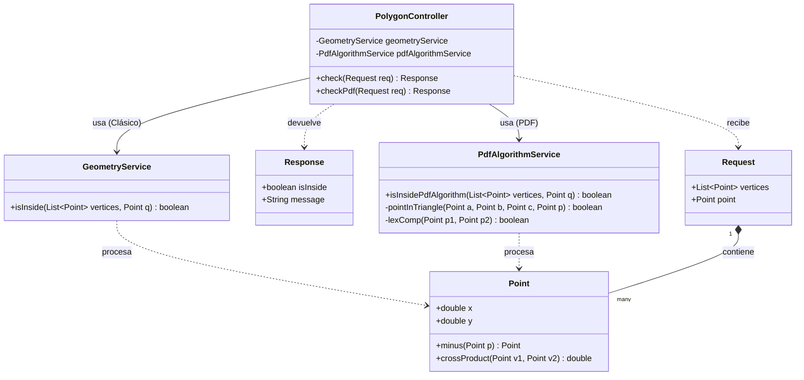
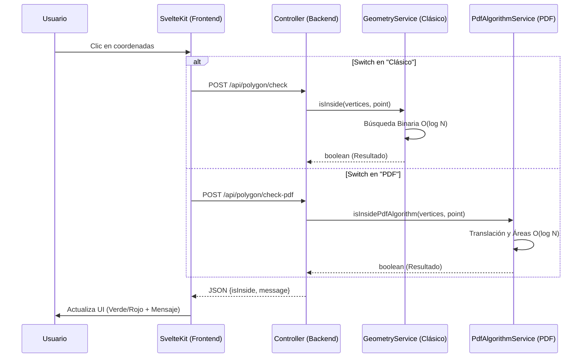
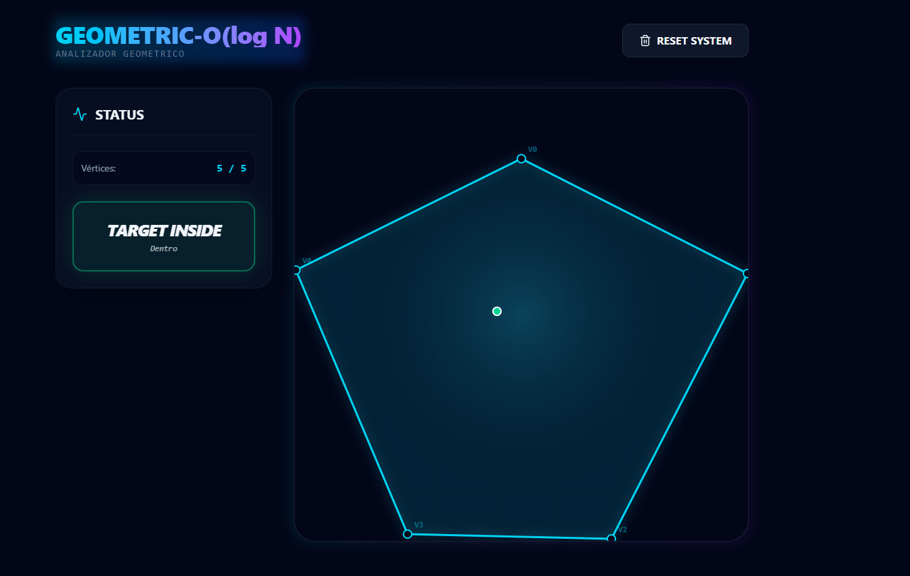
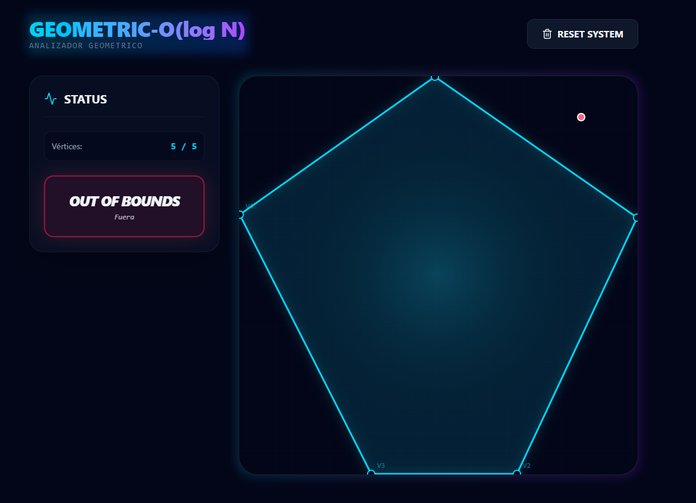
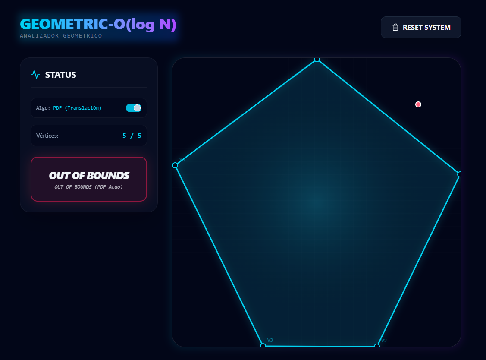
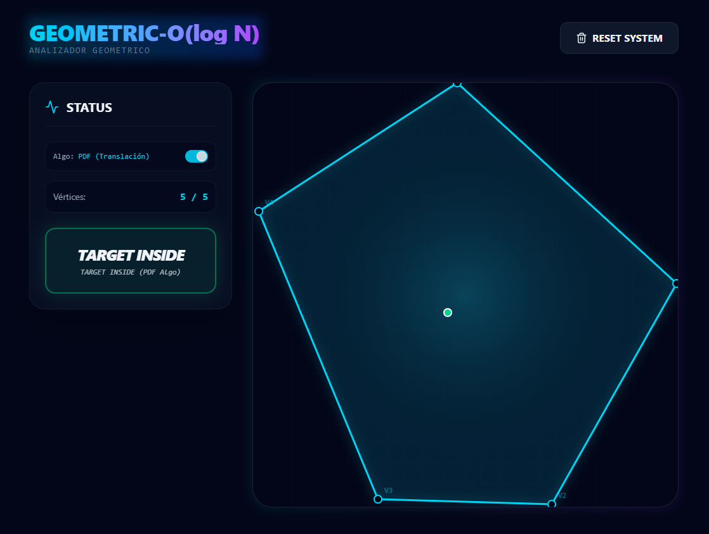

# Reporte de Proyecto: Análisis Geométrico en $O(\log N)$
**Metodología:** Cascada (Waterfall)

---

## Fase 1: Requerimientos
El objetivo del sistema es determinar de manera eficiente si un punto arbitrario se encuentra dentro, fuera o en la frontera de un polígono convexo. 

### Requerimientos Funcionales:
* El sistema debe recibir un conjunto de vértices que formen un polígono convexo, ingresados estrictamente en orden antihorario (CCW).
* El sistema debe recibir las coordenadas de un punto de prueba.
* El núcleo matemático debe calcular la pertenencia del punto utilizando un algoritmo de búsqueda binaria sectorial para garantizar una complejidad de tiempo de $O(\log N)$.
* El sistema debe retornar el resultado de la evaluación visualmente al usuario.

### Requerimientos No Funcionales (Justificación Arquitectónica):
* **Arquitectura Desacoplada:** Aunque los requerimientos iniciales sugerían una interfaz monolítica de escritorio (JavaFX), se optó por evolucionar el diseño hacia una arquitectura moderna Cliente-Servidor (REST API).
* **Escalabilidad y Portabilidad:** Al separar la vista (Frontend en SvelteKit) de la lógica de negocio (Backend en Java/Spring Boot), el sistema se vuelve agnóstico a la plataforma y puede ejecutarse mediante contenedores Docker, superando las limitaciones de distribución de las aplicaciones GUI tradicionales de Java.

---

## Fase 2: Diseño

### 2.1 Diseño de Clases (UML)
El modelo de dominio fue diseñado garantizando la inmutabilidad de los datos. Se estructuraron las entidades de Petición (`Request`) y Respuesta (`Response`) mediante el uso de *Records* en Java. Se implementaron dos servicios distintos (`GeometryService` y `PdfAlgorithmService`) para soportar múltiples algoritmos inyectados mediante inversión de control en el `PolygonController`.

### 2.2 Diseño de Algoritmo y Flujo de Datos
Para lograr la complejidad $O(\log N)$ requerida, el algoritmo principal evita iterar sobre todos los vértices. En su lugar, utiliza el vértice inicial ($V_0$) como ancla y realiza una búsqueda binaria sobre los vectores formados. La vista incluye un selector dinámico para alternar entre el motor matemático clásico y el algoritmo del PDF.

### 2.3 Diseño de Interfaz Gráfica (GUI)
La interfaz de usuario fue diseñada para ser intuitiva y reactiva. Permite la entrada de coordenadas mediante clics sobre un lienzo cartesiano interactivo.

**Evaluación con Algoritmo Clásico:**

---

## Fase 3: Implementación
El sistema se codificó siguiendo estándares de la industria y tipado estricto:

* **Backend (Lógica Matemática):** Desarrollado en **Java 21**, utilizando el framework Spring Boot para la exposición de los endpoints REST. Se aplicaron operaciones de álgebra lineal computacional (resta de vectores y producto cruz).
* **Frontend (GUI):** Desarrollado en **SvelteKit** con TypeScript y estilizado con Tailwind CSS. La comunicación con el backend se realiza mediante la API nativa de JavaScript.
* **Orquestación:** Se implementó un archivo `docker-compose.yml` para compilar y levantar ambos servicios simultáneamente.

---

## Fase 4: Pruebas
Se realizaron pruebas de validación con diferentes morfologías poligonales para garantizar la robustez matemática del sistema ante el orden de ingreso CCW.

| ID | Caso de Prueba | Vértices (CCW) | Punto de Prueba | Resultado Esperado | Resultado Obtenido | Estatus |
|:---|:---|:---|:---|:---|:---|:---|
| 01 | Punto al interior | (1,1), (5,1), (6,4), (3,6), (0,4) | (3, 3) | Dentro | Dentro | ✅ Éxito |
| 02 | Punto al exterior | (1,1), (5,1), (6,4), (3,6), (0,4) | (7, 5) | Fuera | Fuera | ✅ Éxito |
| 03 | Validar rechazo | Intersección en líneas | N/A | Falla esperada | Falla controlada | ✅ Éxito |

---

## Fase 5: Ejercicio 4 (Algoritmo Adjunto PDF)
[cite_start]Cumpliendo con los requerimientos adicionales de la tarea, se implementó un segundo motor matemático basado en la literatura proporcionada para verificar si el punto pertenece al polígono en tiempo $O(\log N)$[cite: 4, 7].

[cite_start]El algoritmo selecciona el punto léxicográficamente menor y ordena los demás en sentido antihorario basándose en su ángulo polar respecto a este origen[cite: 9, 10]. [cite_start]A diferencia del primer enfoque, este algoritmo traslada todos los puntos consultados asumiendo que todos los vectores inician en el origen (0,0) para simplificar los cálculos de las distancias y longitudes[cite: 31, 32]. 

[cite_start]Tras realizar la búsqueda binaria para aislar el punto de prueba dentro de un sector angular [cite: 15][cite_start], el sistema verifica la pertenencia comprobando matemáticamente si el área del triángulo externo tiene exactamente el mismo tamaño que la suma de los tamaños de los tres subtriángulos formados con el punto de prueba[cite: 26]. [cite_start]Si el punto estuviera afuera, la suma de las áreas de estos tres subtriángulos sería mayor[cite: 26].

**Evaluación con Algoritmo PDF (Alternativo):**

