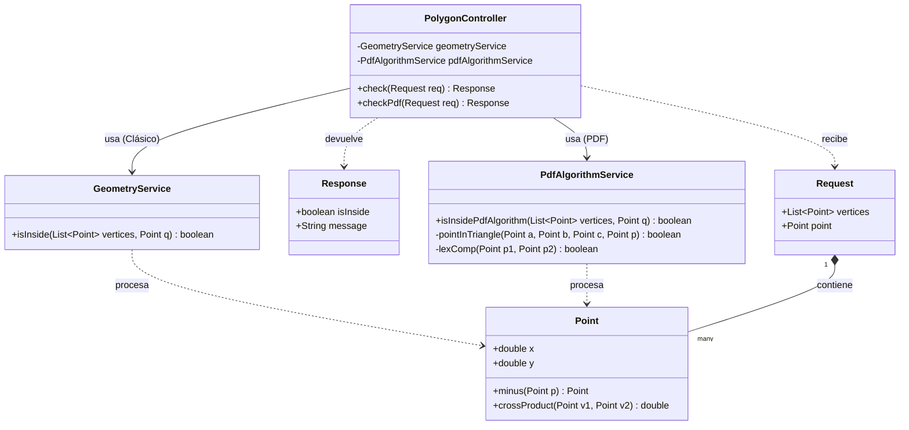
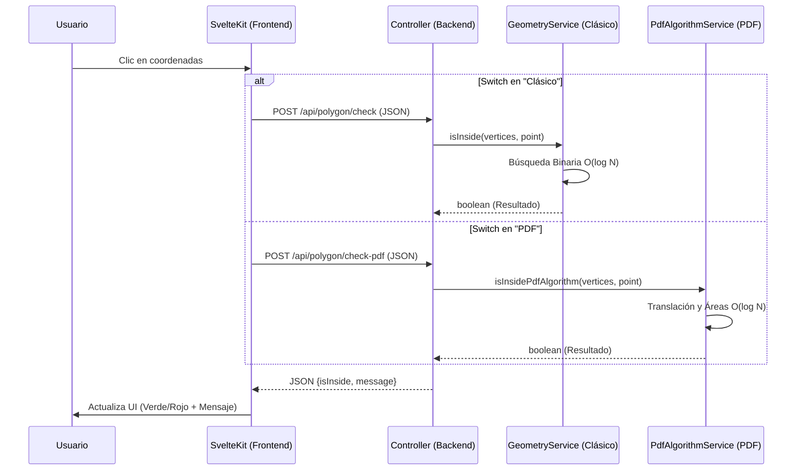
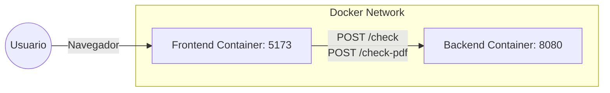

### 1. Diagrama de Clases

```mermaid
classDiagram
    class Point {
        +double x
        +double y
        +minus(Point p) Point
        +crossProduct(Point v1, Point v2) double
    }
    class Request {
        +List~Point~ vertices
        +Point point
    }
    class Response {
        +boolean isInside
        +String message
    }
    class GeometryService {
        +isInside(List~Point~ vertices, Point q) boolean
    }
    class PdfAlgorithmService {
        +isInsidePdfAlgorithm(List~Point~ vertices, Point q) boolean
        -pointInTriangle(Point a, Point b, Point c, Point p) boolean
        -lexComp(Point p1, Point p2) boolean
    }
    class PolygonController {
        -GeometryService geometryService
        -PdfAlgorithmService pdfAlgorithmService
        +check(Request req) Response
        +checkPdf(Request req) Response
    }

    PolygonController --> GeometryService : usa (Clásico)
    PolygonController --> PdfAlgorithmService : usa (PDF)
    PolygonController ..> Request : recibe
    PolygonController ..> Response : devuelve
    GeometryService ..> Point : procesa
    PdfAlgorithmService ..> Point : procesa
    Request "1" *-- "many" Point : contiene
```

---

### 2. Diagrama de Secuencia

```mermaid
sequenceDiagram
    participant U as Usuario
    participant F as SvelteKit (Frontend)
    participant C as Controller (Backend)
    participant S1 as GeometryService (Clásico)
    participant S2 as PdfAlgorithmService (PDF)

    U->>F: Clic en coordenadas
    
    alt Switch en "Clásico"
        F->>C: POST /api/polygon/check (JSON)
        C->>S1: isInside(vertices, point)
        S1->>S1: Búsqueda Binaria O(log N)
        S1-->>C: boolean (Resultado)
    else Switch en "PDF"
        F->>C: POST /api/polygon/check-pdf (JSON)
        C->>S2: isInsidePdfAlgorithm(vertices, point)
        S2->>S2: Translación y Áreas O(log N)
        S2-->>C: boolean (Resultado)
    end
    
    C-->>F: JSON {isInside, message}
    F->>U: Actualiza UI (Verde/Rojo + Mensaje)
```

---

### 3. Diagrama de Arquitectura

```mermaid
graph LR
    subgraph "Docker Network"
        FE[Frontend Container: 5173]
        BE[Backend Container: 8080]
    end
    User((Usuario)) -->|Navegador| FE
    FE -->|POST /check <br> POST /check-pdf| BE
```